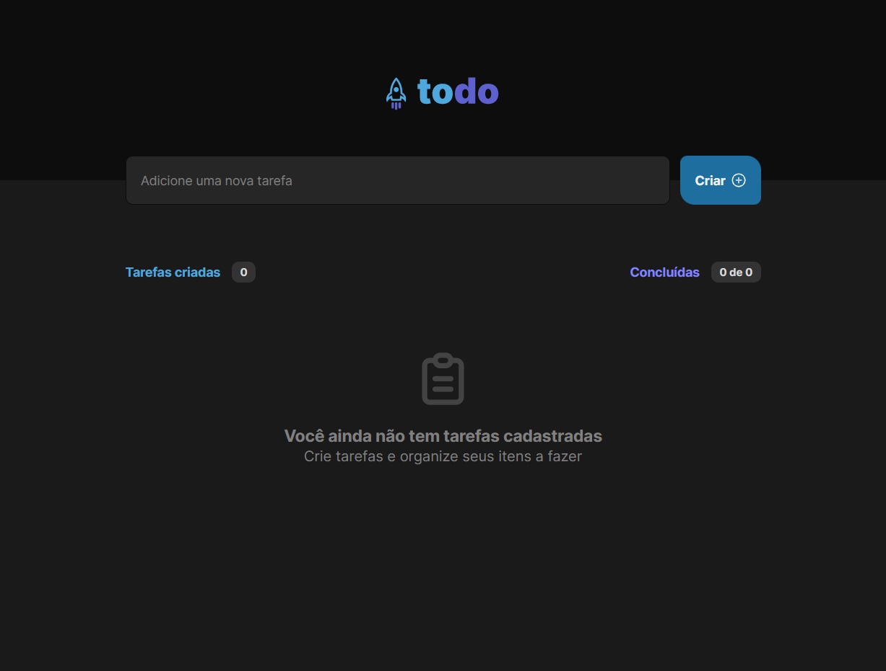
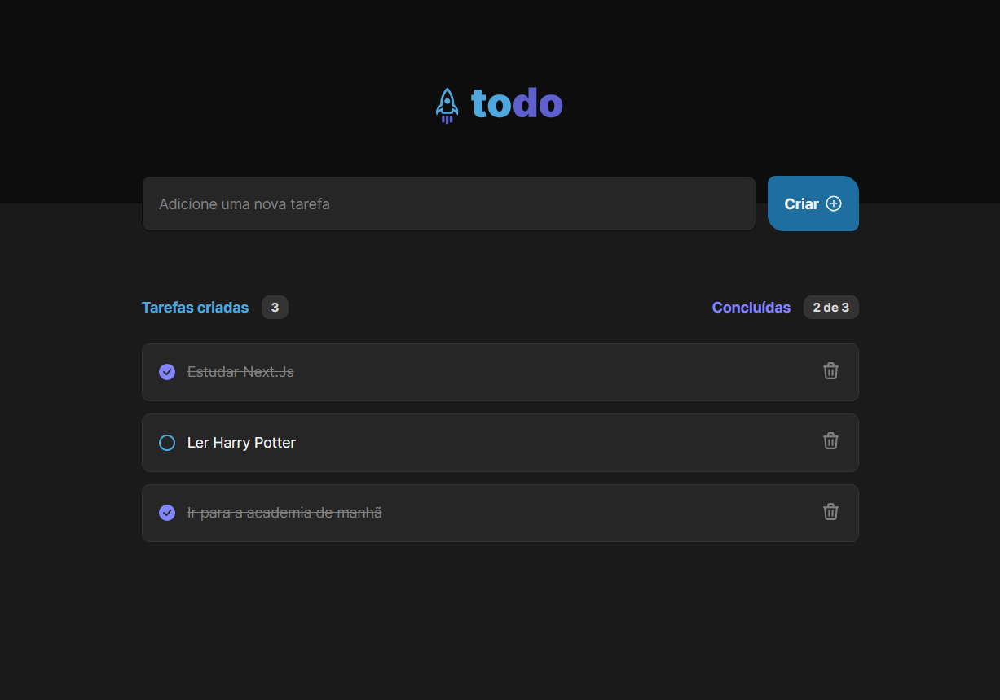

# ToDo React

    

    
    

    

> Trilha Ignite

Primeiro desafio desenvolvido da trilha Ignite ReactJS, praticando e fixando os fundamentos da tecnologia React com hooks, componentização, imutabilidade e propriedades.

## 🛠 Technologies

- React
- TypeScript
- CSS Modules

## 💛 Contact

luca.boer@outlook.com
